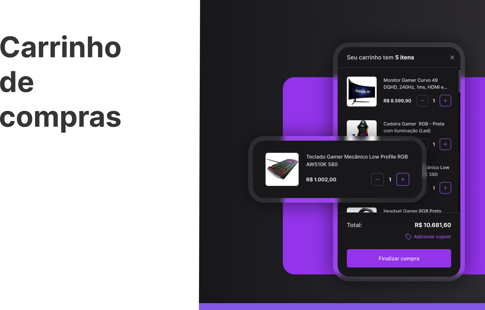

# #BoraCoda Rocketseat - Desafio 21 

> Projeto feito no desafio do #BoraCoda - <b>Carrinho de compras - </b> Rocketseat :rocket:. 

## :hammer_and_wrench: Tecnologias

- HTML
- CSS
- Javascript
- Figma
- Git e Github

## :nut_and_bolt: Principais pontos abordados
### HTML
- Tags semânticas
### CSS
- Display Grid
- Display Flex
- Centralizar os elementos HTML usando FLEXBOX
- Posicionando os elementos HTML usando FLEXBOX

### Javascript

- DOM
- Orientação a objetos;
- Estrutura de dados com objetos;
- Classes
- Funções em Javascript
- Clean Code
- Refatoração

## :mailbox_closed: Contatos

> Email - rosendc30@gmail.com

> Linkedin - https://www.linkedin.com/in/francisco-rosendo-coelho/
